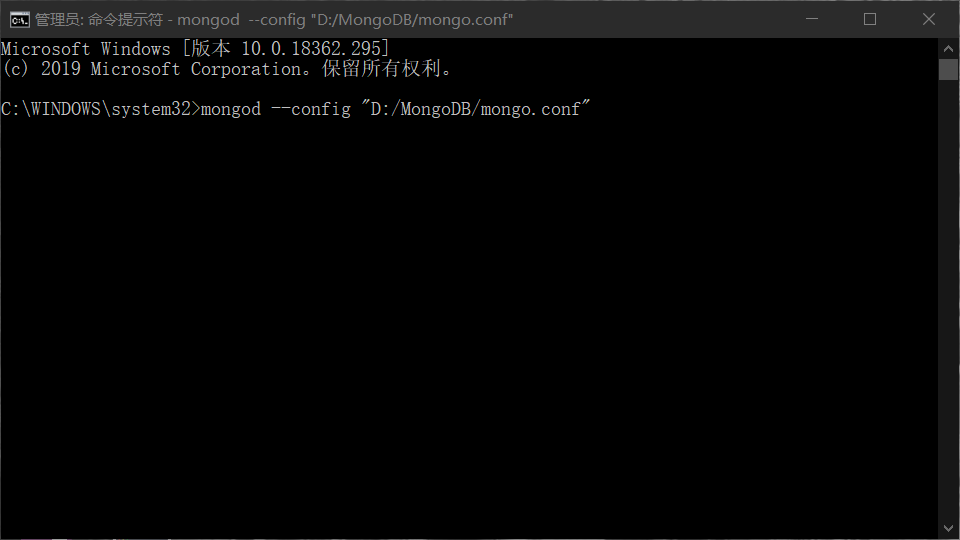
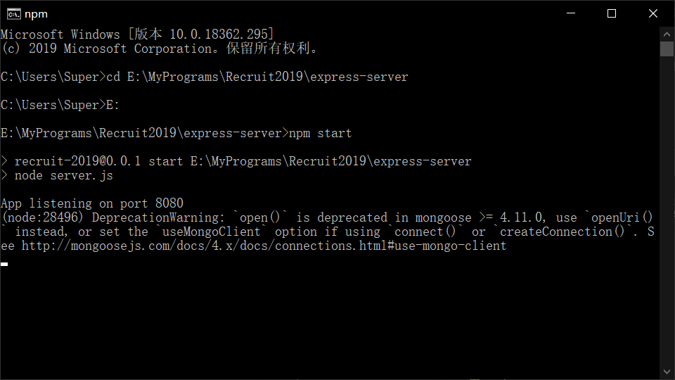
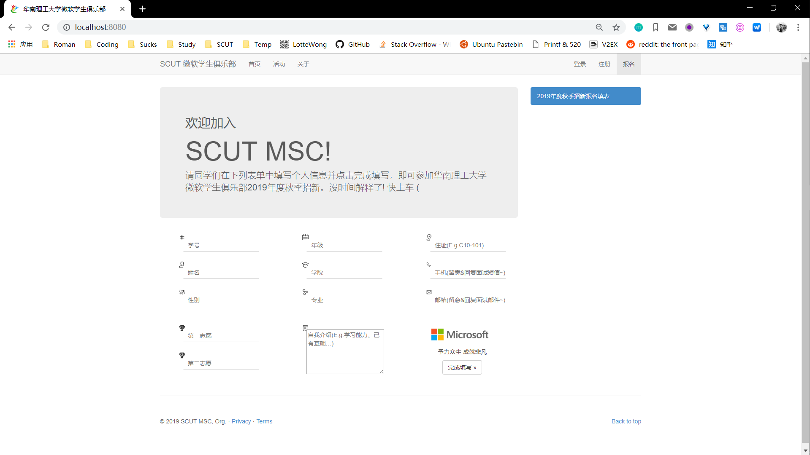
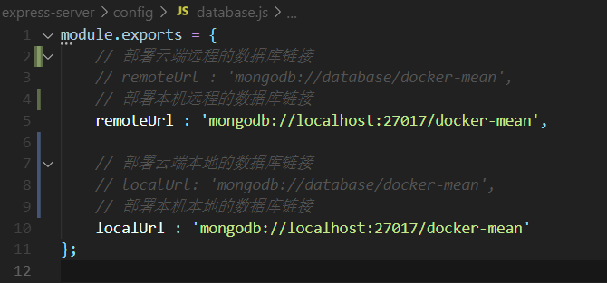

# 华南理工大学微软学生俱乐部2019年度秋季招新报名链接🔗

## 目录结构  

    ├─express-server
    │  ├─app
    │  │  ├─models // 数据库关系模式
    │  │  └─routes.js // 数据库操作及接口
    │  ├─config  // 数据库连接配置
    │  ├─node_modules
    │  └─public
    │      ├─css // 样式
    │      ├─img // 素材
    │      ├─js
    │      │   ├─controllers // 前后端控制器
    │      │   └─services // 后端服务发送
    │      └─index.html // 布局

## 本地测试  

### 前置环境 [local]  

- MongoDB  
- Node.js  
- Express  

### 启动步骤 [local]  

- 打开MongoDB连接  

    

- 启动Express服务  

    

- 浏览器访问`localhost:8080`  

    

## 云端测试  

### 前置环境 [cloud]  

- docker  
- docker-compose  

### 启动步骤 [cloud]  

- 运行`test`文件即可  

## 注意事项  

- 根据测试模式不同需要相应修改`./express-server/config/database.js`内的Url信息  

    
